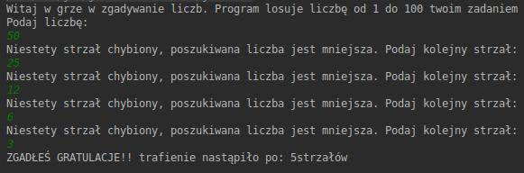
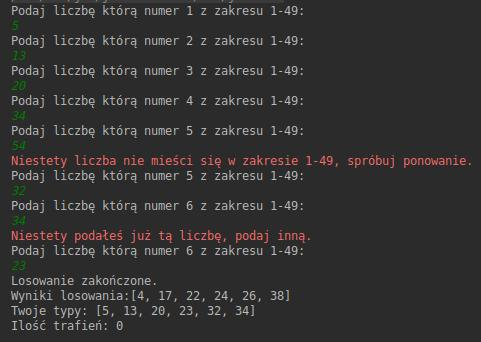
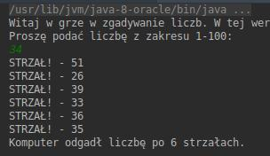
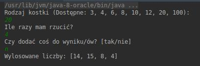
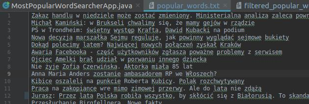
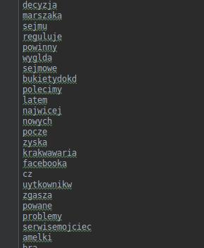

# Warsztaty-Java-MiniGryLiczbowe
Moje pierwsze aplikacje w Javie. Przygotowane na warsztaty w CodersLab i rozwijane w wolnej chwili.

## Zawartość

1. Gra w zgadywanie liczb v.1,
1. Symulator lotto,
1. Gra w zgadywanie liczb v.2,
1. Symulator kostki do gry,
1. Wyszykiwarka popularnych słów.


####Gra w zgadywanie liczb 1.

```
Gra w której komputer losuje liczbę z zakresu 1-100,
a naszym zadaniem jest jak najszybsze odgadnięcie tej liczby.
```

#### Przykład rozgrywki:




#### Planowane aktualizacje:
 - Dodanie prostych ikonek i animacji zwiększających atrakcyjność graficzną programu.
---
####Symulator LOTTO.

```
Gra symulująca grę w Lotto. Wytypuj 6 liczb z zakresu 1-49 i sprawdź czy wygrałeś!
```

#### Przykład rozgrywki:




#### Planowane aktualizacje:
 - Dodanie prostych ikonek i animacji zwiększających atrakcyjność graficzną programu.
---


####Gra w zgadywanie liczb 2.

```
Podobna gra do wersji 1 jednak z odwróceniem roli. 
Tym razem to ty wybierasz liczbę a komputer próbuje ją odgadnąć.
```

#### Przykład rozgrywki:




#### Planowane aktualizacje:
 - Dodanie prostych ikonek i animacji zwiększających atrakcyjność graficzną programu.
---
####Symulator kostki do gry.
```
Program symulujący kostkę do gry. Można go wykożystać w trakcie rozgrywek przy użyciu kości.
Użytkownik ma do wyboru kości: D3, D4, D6, D8, D10, D12, D20, D100.
Ponadto może wykonać wiele rzutów za jednym zamachem oraz daje możliwość dodana wybranej wartości 
do wyniku rzutu.
```

#### Przykład rozgrywki:




#### Planowane aktualizacje:
 - Zmiana danych wprowadzanych z int na pojedyńczego Stringa z którego program pobierze potrzebne wartości.
 - Dodanie prostych ikonek i animacji zwiększających atrakcyjność graficzną programu.

---
####Program znajdujący najpopularniejsze wyrazy.

```
Aplikacja wyszukująca na podanej stronie teksty (np. nagłówków) i zapisuje je do txt.
Z utworzonego txt odfiltrowuje słowa zakazane i powtórzenia tworząc nowy plik txt z
najpopularniejszymi słowami.
```

#### Przykład działania:





#### Planowane aktualizacje:
 - Wprowadzenie obsługi polskich znaków.
---
